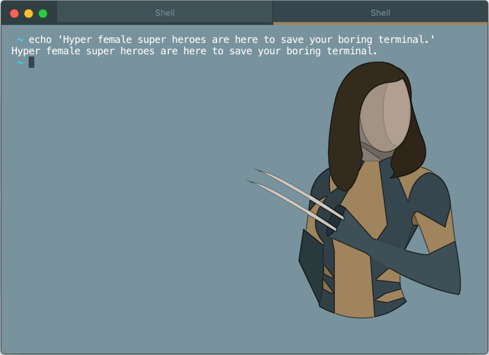
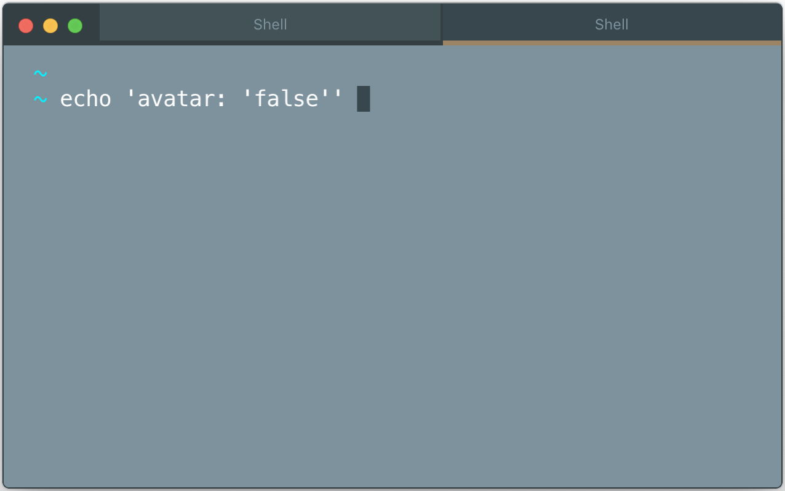
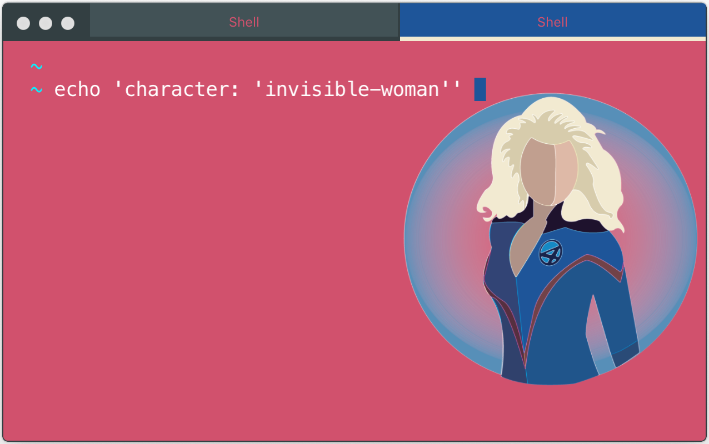
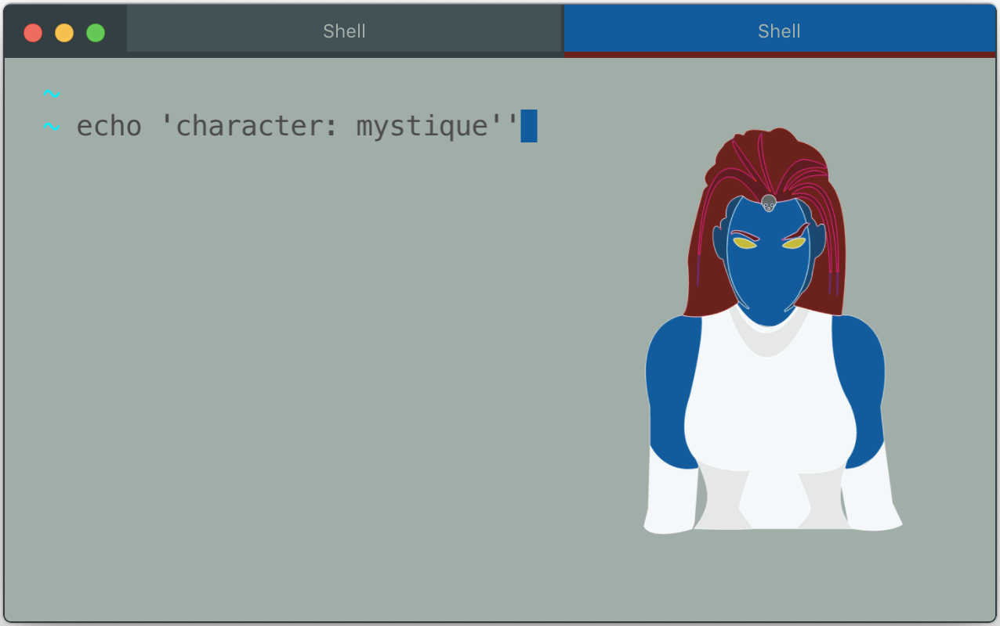
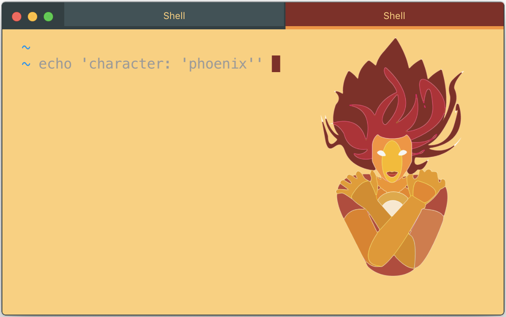
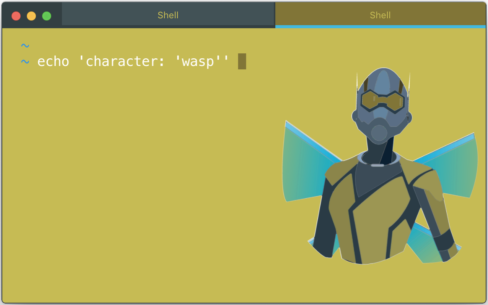
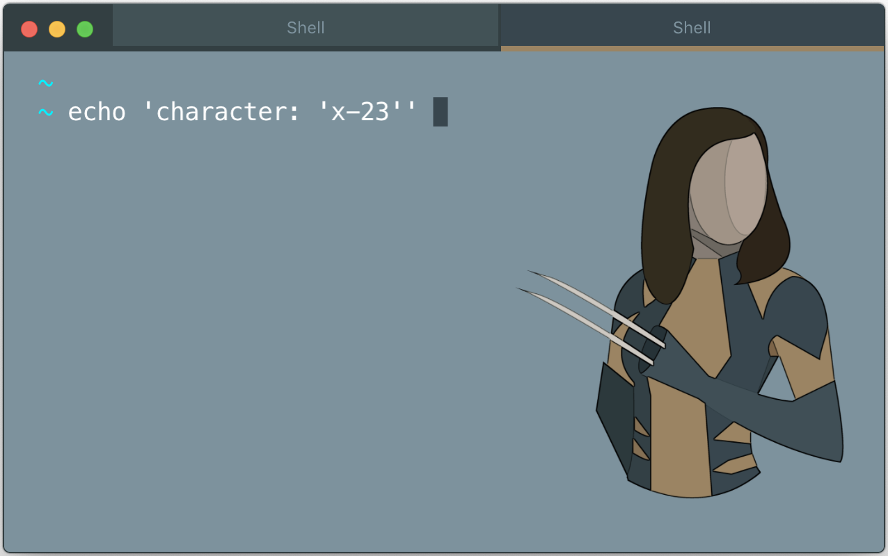

<br />
<h1 align="center">
  Hyper Female Super Heroes
  <span style="display: block; margin-bottom: 10px;"></span>
</h1>

<h4 align="center">
  Hyper female super heroes are here to save your boring terminal.
</h4>

<div align="center">
  <a href="https://github.com/tedweiss/hyper-female-super-heroes">
    
  </a>
</div>
<br />

## Contents

- [Install](#install)
- [Usage](#usage)
- [Options](#options)
- [Available Themes](#available-themes)
- [Team](#team)
- [License](#license)

## Install

### Using the plugin manager - `hyper`

Firstly, ensure you have [Hyper](https://github.com/zeit/hyper/releases) installed in your system.

Once done with that, it's time to install the `hyper-female-super-heroes` theme.

```bash
# fire up a terminal and type
$ hyper i hyper-female-super-heroes
```

### Manually through `.hyper.js`

Add `hyper-female-super-heroes` to the plugins list in your `~/.hyper.js` config file and restart Hyper.

```js
plugins: ['hyper-female-super-heroes']
```

## Usage

Once you have installed `hyper-female-super-heroes`, it's time to set your favorite theme.

Go to your `~/.hyper.js` and add the `FemaleSuperHeroes` settings object below the `colors` object, and define there your theme of choice.

Here is a quick example, where we choose the `x-23` theme displaying the avatar.

```js
config: {
  //...
  colors: {
    //...
  },
  FemaleSuperHeroes: {
    character: 'x-23', // Define your favorite female super hero or villian
    avatar: true  // Activate your theme's background avatar
  },
  //...
}
```

## Options

### `character`

Using this option you can choose your Female Super Heroes character theme along with it's tailor-made syntax color.

The assignable values are:

- `character name` - choose any of the available Female Super Heroes characters by defining their name.<br/><br/>**i.e.** `character: 'x-23'`, `character: 'wasp'`, `character: 'mystique'` **etc**<br/><br/>

- `random` - randomly selects a Female Super Heroes character theme from **all available characters**, each time you fire up a new Hyper terminal session.<br/><br/>
**i.e.** `character: 'random'`<br/><br/>

- `heroes/villians side` - randomly selects a Female Super Heroes character theme from the **heroes side** or the **villians side**, each time you fire up a new Hyper terminal session.<br/><br/>
**i.e.** `character: 'heroes'`, `character: 'villians'`<br/><br/>

- `character array` - randomly selects a Female Super Heroes character theme/theme option from a **defined array** holding **custom multiple themes/theme options**, each time you fire up a new Hyper terminal session. Any from the available Female Super Heroes character **themes** can be chosen!<br/><br/>
**i.e.**
	- `character: ['x-23', 'heroes', 'villians', 'phoenix']`
	- `character: ['invisible-woman', 'wasp', 'x-23', 'mystique']`
	- `character: ['phoenix', 'wasp', 'random', 'mystique', 'invisible-woman']` **etc**<br/><br/>

### `avatar`

Choose whether or not you want the Female Super Heroes character theme `avatar` to be displayed in the background.

The assignable values are:

- `avatar: 'true'` - enable your theme's background `avatar`
- `avatar: 'false'` - disable your theme's background `avatar`

In addition, completely omitting the `avatar` option from your `.hyper.js` will have the same effect as defining it and setting it to `true`. (**Default value**)

<div align="center">
  <a href="https://github.com/tedweiss/hyper-female-super-heroes">
    
  </a>
  <a href="https://github.com/tedweiss/hyper-female-super-heroes">
    
  </a>
</div>

## Available Themes

<details>
<summary>List of all the available themes.</summary>

<br/>

* `invisible-woman`
* `mystique`
* `phoenix`
* `wasp`
* `x-23`

<br/>

</details>
<br/>
<div align="center">
  <h3>Invisible Woman</h3>
  

  <h3>Mystique</h3>
  

  <h3>Phoenix</h3>
  
 
  <h3>Wasp</h3>
  

  <h3>X-23</h3>
  
</div>

## Team

* Code by Ted Weiss [(@tedweiss)](https://github.com/tedweiss)  
* Design by Hilary Wilson [(@hwilson2563)](https://github.com/hwilson2563)

## License

This project is licensed under the MIT License - see the [LICENSE](https://github.com/tedweiss/hyper-female-super-heroes/blob/master/LICENSE) file for details.
